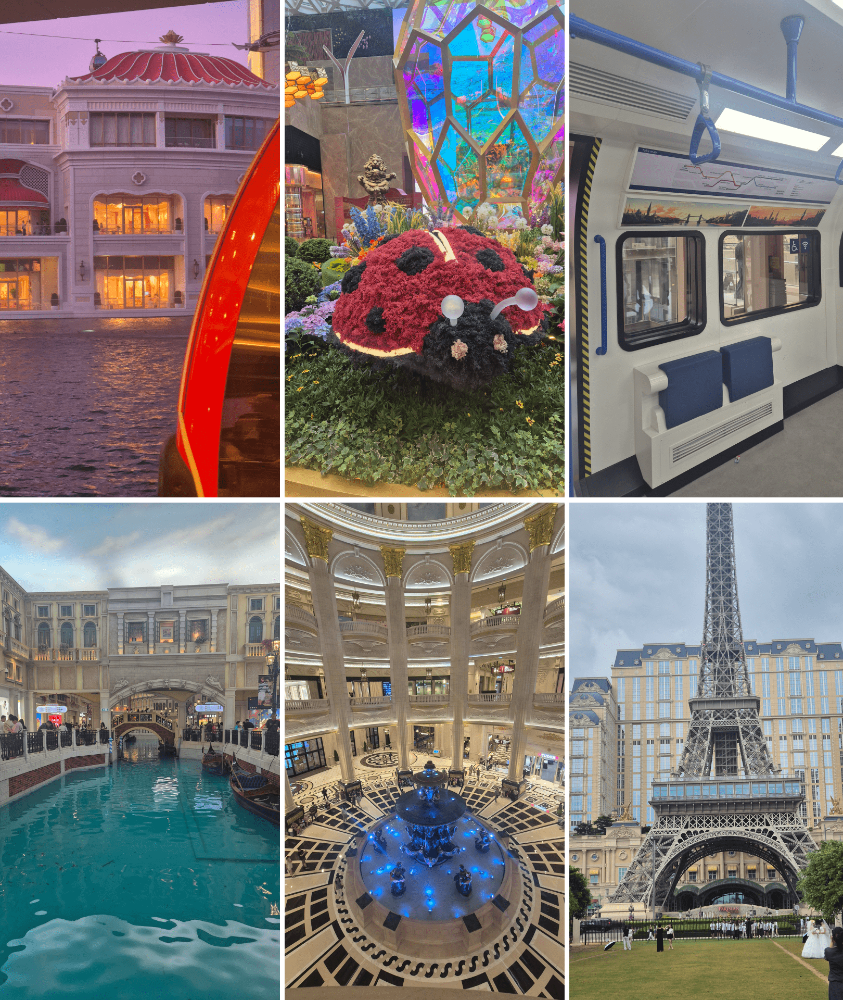
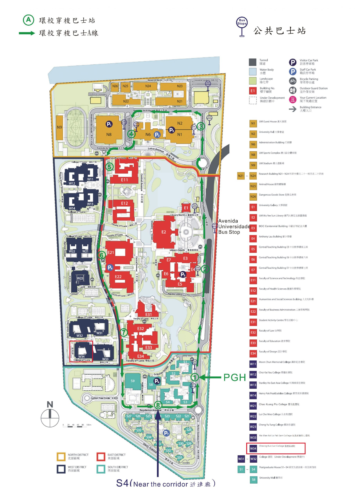

Have you heard of Macau before? If you live in Europe, probably not, if you live in Asia you probably know it for its casinos and gambling.

Macau is a Special Administrative Region (SAR) of China, similar to Hong Kong, but instead a former Portuguese colony (handover in 1999).

So what is life like here?

I'm doing a two month research internship at the University of Macau and wanted to find out!

## First few days in Macau

From South Korea I flew to Hong Kong and took a free shuttle bus to Macau, without even going through the airport immigration in Hong Kong. This shuttle service is nice, and takes you to Macau in about two hours. (But another time I had to find out the hard way that this shuttle does not operate during the night.)

Public transport in Macau is almost exclusively done by bus. But there are also taxis, and there is even a train line. This train line, the LRT (Light Rapid Transit), is probably not that useful for you though, as it has not yet been expanded into many relevant parts of Macau. But it's fun to take, since you get a great view.

Since I arrived at the end of June, the weather was insanely hot and humid. I'd feel sticky after two minutes outside. Macau also regularly experiences typhoons during this season. Which means sudden rain, very heavy rain, heavy wind and storms.

A few of my culture shocks included:
- Card not being accepted, having to use the MPay app instead.
- Cockroaches in a lot of places.

## Apps needed for Macau

- MPay - For paying for stuff in Macau. Can be charged at convenience stores with cash.
- Bus Travelling System - Information on the buses, such as their routes and times. Helpful when using it in combination with Google Maps.
- WeChat - Since there are many Mainland Chinese in Macau, they'd prefer this chatting app. Macau locals often use WhatsApp or Instagram.

Non specific:
- Translation App - Some translation app such as *Google Translate* will definitely be useful.
- VPN App - Unlike in China, Instagram, WhatsApp, etc work in Macau, but some services still do not work. Also, some services such as ChatGPT or Google Gemini are blocked.

It's easy to go to Mainland China from Macau as well. And I'd highly recommend it, things are generally cheaper in China. If you go to China you will need:
- WeChat Pay and/or AliPay - For making payments. Make sure you fully registered so your account doesn't get locked after a few transactions. With non-Chinese banks these apps do not work in Macau.
- Amap (Gaode) - For navigation. Also very useful for the University of Macau campus.
- DiDi - The taxi app for China. Compared to Germany taking a taxi / DiDi here is very cheap.

## Worth visiting?

I feel mixed about recommending to visit here. Macau is smaller and less international than its neighbour Hong Kong. And if you are interested in China, visiting Mainland China makes much more sense.

Macau has a unique cultural background because of its Chinese and Portuguese blend, but it has already moved away from its Portuguese one. Official signage is still in Chinese and Portuguese, but the Portuguese language is rarely used in daily life by Macau residents.

This leaves some interesting Macanese and Portuguese cuisine, as well as some nice architecture, but not much more that can't be seen in a day or two.

Macau's main appeal are its casinos, which are fun to visit for a day even if you don't have an interest in gambling like me. 

## Which language is used in Macau?

Which languages are actually used in Macau interested me immensely when I first heard about Macau, since information on this online also seemed sparse.

Macau residents use Cantonese. In many places in Macau the majority of people are from mainland China though, and they use Mandarin. Portuguese is still used in official signs in addition to Traditional Chinese, but not actually used anymore by the people except for rare cases. English is spoken well at the Casinos and often used by the many immigrant workers that come from other Asian countries, but often not spoken well by Macau locals or Mainland Chinese.

Macau uses traditional Chinese writing, just like Taiwan and Hong Kong. Mainland China instead uses simplified Chinese, so the characters there are simpler and less complex.

## Life at the University of Macau

So what is life like, especially at the university?

The first thing I noticed was how difficult it was to get there. Usually *Google Maps* is used for navigation in Macau. But not in Mainland China[^1]. Why is this relevant? The University of Macau has been built on borrowed land from China, so geographically it is in Mainland China even though it belongs to Macau. Thus *Google Maps* shows this uni to be partly inside a river. Chinese navigation apps such as *Amap* works on the campus instead. Alternatives such as CoMaps or Maps.Me which are based on OpenStreetMap, also work, but are generally not well maintained.

The campus is large and offers different things, there's:
- multiple cafeterias (UM Mall < Next Kitchen < Azuca).
- a small university mall with restaurants, cafes and a supermarket.
- a sports building which includes a doctor's office, a swimming pool, gym, and more.
- badminton courts.
- library for studying.

Cafeterias here close very early, if you go to eat at 20:00 you will probably be the last person at that cafeteria. The only exception was the McDonalds that was new.

Generally it was too hot during the summer to spend a lot of time outside.

## My work & daily life at the University of Macau

A was able to find this internship at the University of Macau through [IAESTE](https://iaeste.org/), a global internship program for STEM majors.

The research project I applied to was about the LRT (Light Rapid Transit) line in Macau, so the automatic train line. Main focus of this project was to assess the service quality.

In total there were 7 other IAESTE interns at the University who were all working on different projects. As it was summer holidays for regular students at the University of Macau there were almost no events, club activities or similar going on on the campus.

During the internship I was living at the dormitory of the university. The room at the dormitory is shared, so I slept in the same room as another IAESTE intern from Germany. The dormitory did not have a kitchen, but the washing machine and dryer were free. The room had cockroaches when I arrived, which also came back from time to time. Termites inside the wooden door also sometimes made sounds during the night. (For my Chinese friends: In Germany it's **not** normal to have these in your house.)

The work itself was mostly relaxed and I felt very welcome by the professor who I worked for. The Macau people I had met were very kind, there also seems to be a strong sense of community and belonging here.

## Further recommendations

Supermarkets:
- San Miu Supermarket
- Royal Supermarket

Other stores:
- DON DON DONKI - Japanese store that sells a variety of things.
- New Yaohan - A department store.
- Ikea - The Ikea in Macau has a nice selection of food, even European bread for a good price.
- Daiso - Sells lots of different items for daily life, very cheap.

Personal care items:
- Watsons - Not the Watsons convenience store, don't get them confused.
- Mannings 

You will want to get a SIM or eSIM which has a number, not only mobile data, since you need a number to register for a lot of apps.

Hong Kong Dollars are also accepted in Macau, but usually HKD are worth slightly more so you might be overpaying a bit if you pay with them.

[^1]: Why Google Maps is slightly wrong about China: https://youtu.be/L9Di-UVC-_4?si=QOYU2Lb7e5tDT0zS