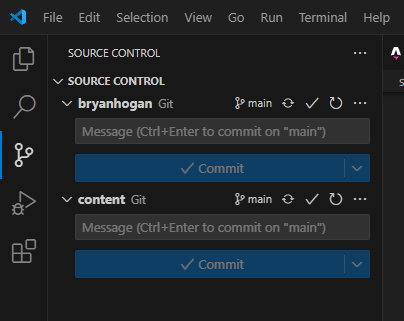

My blog uses markdown files. I love using Obsidian to write markdown. So how do I (and you) easily write markdown based blog posts for frameworks such as Astro using Obsidian?

Since my website uses Astro I will mention Astro, but this approach works just as well for other static site generators that use markdown like Hugo, Jekyll, Eleventy, Next.js and more.

The best way is: GitHub & Submodules  
Submodules might sound complicated at first, but it really isn't. It just means that our markdown content is another repository and we add that repository to our main repository.

I had previously tried using Symlinks, but that approach does not feel reliable and is gimmicky.

## All steps on getting started with using Obsidian to write Astro markdown content

A quick overview of all the steps:

1. Create folder with markdown content
2. Make this folder into a repository
3. Open folder with Obsidian and add `Git` plugin
4. Add this repository to the main repository
5. Adjust build step so that the new submodule repository is actually used

That's it!

### Step 1: Content folder

First we want to create the folder that has the markdown content. If you also use Astro this is what would be in the `src/content`/ folder.

If you use images or other assets, which you probably do, you want to create another folder for that.

I have two folders:
- `/blog` which contains all the posts written in markdown.
- `/blog-assets` which contains things like images that I show within my blog posts.

### Step 2: Create repository

Now we want to create a repository for this content.

This means we will have one main repository where all our files for the Astro project live, such as all the components, pages, layouts, styles files and everything else you need for your website, and another repository with just the two folders we created earlier.

<details><summary>How to use Git to do that</summary>

Make sure you have Git installed on your device. You can use the visual interface in something like Visual Studio Code which should make this easier for you. But to make it short you will do these steps in your command line interface: `git init` -> `git add *` -> `git commit -m "commit message"` -> `git push`.

</details>

### Step 3: Obsidian and `Git` plugin

Within Obsidian, open the file as a new vault that contains the two folders.

Add the community plugin `Git`. Since we have already created and linked the content to a repository the plugin will already know where to pull and push the content to.

### Step 4: Submodule magic

Now we will be adding the smaller repository that only has two folders to the larger repository that has our front-end stuff as a submodule.

When using Astro we want our markdown content within a folder of the content folder. Use `git submodule add small-repository-link src/content` to add the two folders. Replace the link with your repository that has the markdown files.

Add, commit and push that this new submodule has been added. 



### Step 5: Adjusting building steps

Now the step I struggled the most with, at least when using DigitalOcean. Using Cloudflare it just worked, so it depends on how you host your static website.

Since submodule might not automatically be included when we do a pull of this repository we have to specifically state that we do want to include the submodule.

Also, when you clone your repository again in the feature, e.g. you get a new laptop or pc, include a `--recurse-submodules` with the clone, or if you forgot to do so after doing the usual `git clone ssh-link` do `git submodule update --init --recursive`.

#### Cloudflare

It just works!

#### DigitalOcean

A simple way to do this would be to just add `--recursive` for the pull command, but I couldn't find a way to do this within DigitalOcean so I had to get a bit more creative.

In DigitalOcean:

1. Add this to the build command: `git submodule update --init --recursive && npm install && npm run build`
2. Use https instead of ssh for the submodule. DigitalOcean didn't work with ssh, but https works. To do this adjust the `.gitmodules` file which was created when we added the submodule. Use this command within the main repository to change the submodule to https: `git config --file .gitmodules submodule.src/content.url https://github.com/your-username/your-submodule-repo.git` and then `git submodule sync`.

That's all! 🎉

### Optional: Faster pushing in VSC

*Update July 2025*

Now I have been using this setup for multiple projects of mine and it works great. But there was one complaint that I had when it comes to editing my projects in Visual Studio Code. Each change requires **adding**, **committing** and **pushing** on both the submodule repository and the main repository, which sometimes takes more time than the small change itself. But there is a solution to this.

Within Visual Studio Code add the [Tasks plugin](https://marketplace.visualstudio.com/items?itemName=actboy168.tasks).

Then in the `.vscode` folder we want to add a `tasks.json` file.

<details>

<summary>Content of the <code>tasks.json</code> file.</summary>

```
{
  "version": "2.0.0",
  "tasks": [
    {
      "label": "ACP ALL",
      "type": "shell",
      "command": "powershell",
      "args": [
        "-ExecutionPolicy", "Bypass",
        "-File", "commit-push.ps1",
        "${input:commitMessage}"
      ],
      "problemMatcher": []
    }
  ],
  "inputs": [
    {
      "id": "commitMessage",
      "type": "promptString",
      "description": "Enter commit message",
      "default": ""
    }
  ]
}
```

</details>

Then in the root of the project we need to add the script that the Tasks plugin uses to add, commit and push first the submodule and then the main repository. I am using Windows and thus can use powershell commands for that, I called my script `commit-push.ps1`.

<details>
<summary>Content of the <code>commit-push.ps1</code> file.</summary>

```
param([string]$msg)

# 1. Detect submodule path (first entry in .gitmodules)
$submodulePath = Get-Content ".gitmodules" |
                 Select-String "path\s*=" |
                 ForEach-Object { ($_ -split " = ")[1].Trim() }

if (-not $submodulePath) {
  Write-Host "No submodule found." ; exit 1
}

###########################################################################
function Commit-And-Push {
  param([string]$message)

  git diff --cached --quiet
  if ($LASTEXITCODE -ne 0) {
    git commit -m $message       ; if ($LASTEXITCODE) { exit 1 }
    git push                     ; if ($LASTEXITCODE) { exit 1 }
  } else {
    Write-Host "No changes to commit here."
  }
}
###########################################################################

# 2. SUBMODULE
Write-Host "Processing submodule '$submodulePath'..."
Push-Location $submodulePath
git add -A
Commit-And-Push $msg
Pop-Location

# 3. MAIN REPO
Write-Host "Processing main repo..."
git add -A
Commit-And-Push "Update submodule + misc: $msg"

Write-Host "All done!"
```
</details>

That's it! Now your Visual Studio Code will show a button on the bottom left called "ACP ALL", press it to quickly add, commit and push all relevant files.