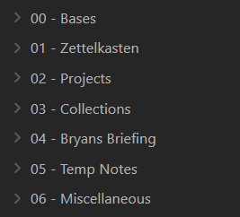

I've been using Obsidian for many years now and I enjoy it a lot, for me it's very helpful. Obsidian can be highly customized, and that's great. Important for me is that my Obsidian vault supports me in doing other work, and I've found a system that works well. So what does it look like?

My whole [vault template is available on GitHub](https://github.com/BryanHogan/obsidian-vault-template). (Currently some elements mentioned here are still missing, work in progress)

## What I use my Obsidian vault for

I use my Obsidian Vault for a lot of things: 
- For writing content such as my blog posts or [monthly e-mail newsletter](/follow).
- For collecting, summarising and preparing information.
- For managing projects, and other aspects of my life such as my health.
- For collecting information on books, video games, YouTube videos and more.

## Rules for a simple, long-lasting setup

These are the rules I set myself:
- **Keep it simple.**

Some additional rules:
- Avoid using multiple Vaults.
- Minimise folder usage.
- Avoid non-standard markdown.
- Pluralize tags.
- Use dates in `YYYY-MM-DD` format.

I try to avoid unnecessary modifications and prefer a simple long-lasting system, so I'm careful about any plugins and CSS snippets I add. I use the basic dark theme of Obsidian.

## Vault structure

I use the following vault structure, each name here is a folder:

0. Bases - Contains Bases files, more on these later below.
1. Zettelkasten - Contains my knowledge notes, in a bottom-up approach, more on that later below.
2. Projects - Contains notes relating to projects and similar things. Also using a bottom-up approach here.
3. Collections *(Contains: Blog, Books, Clippings, Games, Videos)* - First folder that uses sub-folders, each sub-folder contains notes belonging to a specific area.
4. Bryan's Briefing *(Contains: Posted Archive)* - Writing my monthly newsletter here. Moving notes into the archive folder once they have been posted.
5. Temp Notes - Notes that are temporary, thus only exist for a very-short period of time.
6. Miscellaneous *(Contains: Archive, Attachments, Templates, Someday Notes)* - Things that didn't get a home yet, such as template notes and file attachments, e.g. audio and image files.

I prefer this approach of 1) permanent knowledge 2) project specific notes 3) collections on something 4) monthly reflections and more over PARA or other structures. (*In the following the folder I drop the numbering when mentioning the folder, `/Zettelkasten` and `01 - Zettelkasten` is the same*.)

## Smart notes: Bottom-up note-taking

My Zettelkasten and Projects folder are the two most important folders of my Vault.

- Knowledge notes go into `/Zettelkasten`.
- Notes which are less long-term, e.g. they belong to a project or problem that can end, belong into `/Projects` .

Notes in both of these folders use the same bottom-up approach.

Notes reference other notes via linking, so via `[[ ]]`. I use a pre-set template of properties depending on which folder the note goes to. Both Zettelkasten and Projects notes usually refer to a topic of which they belong to, e.g. `[[Korean]]` for notes about the Korean language.

By doing this I will find that some notes belong together, as they reference the same topic. These notes I then make into a `Map of Content`. With this approach groups and structure forms naturally, as notes can belong to multiple different groups.

If you are new to taking "smart notes" / "evergreen notes" / "Zettelkasten notes" / bottom-up notes I recommend my post going into [further details on these](/blog/obsidian-zettelkasten).

## Collections: Books, games and more

Knowledge goes into `/Zettelkasten`, less long-term project specific notes go into `/Projects`, but what about blog posts, games, books?

### Books

Each book that I want to read, am reading, have read or stopped reading is stored as a note in `/Collections/Books`. With Bases I can easily create overviews of these book entries and sort & filter them. These overviews are included and linked to from the folder note that opens up when I click the book folder.

Each book note includes a chapter overview, plus a quick summary, notes on who it's worth reading for and how it has helped me. Although I'm not consistently adding this information, which is okay since this is just for me. Knowledge from books is added to `/Zettelkasten`.

Sometimes I want to link to a specific Zettel note from the chapter overview of a book, so knowing the link name can be different from the note it is linking to is very helpful here, e.g. `[[actual note name|name thats shown]]`.

### Games and Videos

This `/Collection/Games` folder is very similar to the one for books, but instead for video games.

The one for `/Collection/Videos` is more of a summary of useful YouTube videos I watched. Writing a summary, and then creating atomic notes from these for my `/Zettelkasten`.

### Clippings

Using the [Obsidian Web Clipper](https://obsidian.md/clipper) I sometimes add content from the internet to my vault. I usually do this when I want to reference it later on, or use it as a base to create some Zettel from it. By adding it to the vault I can be sure that it will be there when I need it again in the future, remember that websites might be taken offline at any time.

## Templates I use

Templates allow me to pre-fill notes with relevant properties / frontmatter. Templates are part of core Obsidian, you just need to enable them and also set a hotkey to insert them.

- [Zettel Template](https://github.com/BryanHogan/obsidian-vault-template/blob/master/05%20-%20Miscellaneous/Templates/01A%20-%20Zettel.md)
- [Zettel MOC Template](https://github.com/BryanHogan/obsidian-vault-template/blob/master/05%20-%20Miscellaneous/Templates/01B%20-%20Zettel%20MOC.md)
- [Project Note Template](https://github.com/BryanHogan/obsidian-vault-template/blob/master/05%20-%20Miscellaneous/Templates/02A%20-%20Project%20Note.md)
- [Project MOC Template](https://github.com/BryanHogan/obsidian-vault-template/blob/master/05%20-%20Miscellaneous/Templates/02B%20-%20Project%20MOC.md)
- [Blog Post Template](https://github.com/BryanHogan/obsidian-vault-template/blob/master/05%20-%20Miscellaneous/Templates/03A%20-%20Blog%20Post.md)
- [Book Template](https://github.com/BryanHogan/obsidian-vault-template/blob/master/05%20-%20Miscellaneous/Templates/03B%20-%20Book.md)
- [Game Template](https://github.com/BryanHogan/obsidian-vault-template/blob/master/05%20-%20Miscellaneous/Templates/03C%20-%20Game.md)
- [Video Template](https://github.com/BryanHogan/obsidian-vault-template/blob/master/05%20-%20Miscellaneous/Templates/03D%20-%20Video.md)

## How to navigate & rediscover information

Obsidian has something called ["Bases"](https://help.obsidian.md/bases). These allow you to display your notes in different table or card views. Bases allow you to filter and sort these views in any way you like.

I use these Bases in combination with the FolderNotes plugin. This allows me to create overview pages for when I click on my `01 - Zettelkasten` or `02 - Projects` folders. These overview notes include Bases that list all relevant MOC's (Map of Contents), active projects, and then other relevant content that I want to access, ending with a complete list of all notes in that folder.

By creating links within notes, creating MOCs that utilize Bases, and just the general text search in Obsidian I'm confident that relevant information in my vault doesn't get lost, especially since most of my knowledge uses the bottom-up approach described above.

## Plugins I use

I try to use a minimal amount of plugins, especially community plugins. Each plugin introduces complexity, risks, longer loading times and can generally make your system less future proof.

I use the following community plugins:

- [FolderNotes](https://github.com/LostPaul/obsidian-folder-notes) - Make a note belonging to a specific folder, clicking that folder opens the note.
- [Filename Heading Sync](https://github.com/dvcrn/obsidian-filename-heading-sync) - I don't display the file-name as the heading in Obsidian, turned that off in the settings. Instead I use a `#` at the beginning of each file. This plugin syncs that h1 heading with the file name.
- [Dataview](https://github.com/blacksmithgu/obsidian-dataview) - Obsidian Bases has mostly replaced my need for the Dataview plugin, but I still use it for some inline JavaScript needs, e.g. creating a link to today's note (which I do in a separate journaling vault).
- [Book Search](https://github.com/anpigon/obsidian-book-search-plugin) - Allows me to quickly add book notes with a relevant cover into my vault.
- [Home Tab](https://github.com/olrenso/obsidian-home-tab) - Adds a search bar onto empty tabs. Allows me to easily search through my notes, feels nice.
- [Language Tool Integration](https://github.com/Clemens-E/obsidian-languagetool-plugin) - Spelling checker.
- [Lazy Plugin Loader](https://github.com/alangrainger/obsidian-lazy-plugins) - Allows me to delay some plugins start-up time, improving launch time on Obsidian. Especially useful for mobile.

## Styling & themes

The default dark theme of Obsidian works well for me, so I'm using that.

The only CSS snippet I use is one that allows me to make tables `full-width` in notes, so the note itself is kept in readable line length but the table uses the whole available space, useful when working with larger markdown tables.

## More about Obsidian

### For writing my blog posts on the web

I use Obsidian to write the content for my personal website as well. This website has been built with Astro. There are many static site generators that can take markdown files to create web pages.

For more information on [how to use Obsidian to create a website look here](/blog/obsidian-website).

Then I found using a separate GitHub repository as a submodule for Astro to be a good approach for writing markdown for your website anywhere, I wrote about that [GitHub submodule approach here](/blog/obsidian-astro-submodule).

### Syncing my vault across desktop and mobile

Obsidian works on both desktop and mobile. Since Obsidian is actually just a collection of markdown files, file sync or cloud service can be used. I back-up my vault from time to time to a personal GitHub repository. For synching I use Google Drive, this includes the Google Drive Desktop program I use on Windows, and the DriveSync app on Android.

I wrote a more [detailed comparison of different ways to sync Obsidian and the setup I use here](/blog/how-to-sync-obsidian). 

### Obsidian or something else?

There's many note-taking applications out there, but for me Obsidian is definitely one of the best. But it's not the only one I use, as different programs have different use-cases. I have a more detailed comparison of [Obsidian vs Notion here](/blog/notion-obsidian-comparison).

I also not only use Obsidian, I use Notion for and Logseq as well. Notion for content that is collaborative or that can use the better Database function there, e.g. the Kanban in Notion is great. Logseq for short daily notes, as having a separate program for quick notes feels better and daily entries in Logseq are shown in an infinite scroll-able vertical view, which makes it easier to find past entries.

Other note-taking applications that might interest you:

- [Capacities](https://capacities.io/) - Web-based markdown-based note-taking tool, similar to Obsidian.
- [Affine](https://affine.pro/) - Self-hostable note-taking tool, similar style to Notion, introduces whiteboard views.
- [SiYuan](https://github.com/siyuan-note/siyuan) - Self-hostable note-taking tool, similar to Notion.
- [Logseq](https://logseq.com/) - Open-source note-taking tool, markdown-based but makes everything into lists, overall lower quality than Obsidian.

Further Links 💡

- Obsidian vault tour of the current Obsidian CEO: https://stephango.com/vault

