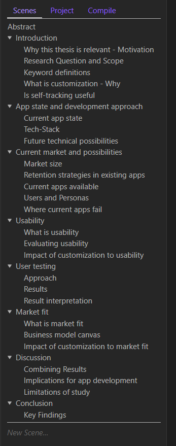

Should you use Obsidian for academic writing?

I recently finished my bachelor thesis. I've been using Obsidian for multiple years now, all my blog posts are written in Obsidian, and I do a lot more in Obsidian. Writing content in markdown is fast and comfortable. So I thought, why not write my bachelor thesis in Markdown with Obsidian as well?

I then realized later on that this is not the best idea, but let's start from the beginning

## Getting Started

To further enhance some aspects of Obsidian and make academic writing within Obsidian better I found some plugins:

- [Longform](https://github.com/kevboh/longform) - Longform allows you to organize a collection of notes into a nested list, which you can then combine into one document. I like this because it lets me split my thesis into multiple parts, then start writing on one part and just focus on that. I can then later easily adjust the order.
- [Zotero Integration](https://github.com/mgmeyers/obsidian-zotero-integration)- If you do academic work you probably already know Zotero, it's a reference manager. It makes it much easier to create academic references, and with this plugin you can include them visa a "@ + citekey".
- [Pandoc Reference List](https://github.com/mgmeyers/obsidian-pandoc-reference-list) - I don't even use Pandoc, so why use this plugin? It will display a list of all the references in your current note on the right. The idea to use this plugin with the Zotero Integration came from [this video](https://youtu.be/8yMko1m8XSQ) by Paul.

Now I had everything I need, I thought, I can create headers and lists via the normal markdown syntax. I can include images like that as well. Longform allows me to focus on each chapter. I had a list of around 6 to 8 main chapter, and each of them had multiple subchapters. This was also represented as a list via the Longform plugin.

📷 Longform Plugin screenshot

References and citations were handled via the Zotero Integration and Pandoc Reference List, although actually displaying a reference via the reference list required a restart it worked without complains so far.

## The Problem

What I liked about this workflow compared to writing LaTeX or Microsoft Word / LibreOffice Word is that it was simple, it allowed me to focus on the content of each chapter with minimal distractions.

But there are also limitations. The PDF export of Obsidian is not enough. I need a table of contents, tables and figures, correct page numbers, and further format requirements. So the content in markdown had to be converted to LaTeX or .*odt*.

Since the content itself was just markdown I could also use Zettlr, which has the Pandoc conversion features built in.

Converting via something like Pandoc wasn't perfect though, the end result always require further adjustments. So I couldn't find a way to convert the markdown file to a adequate result.

For me the separation of content and appearance was important, I see it as a fundamentally better approach on writing long-form content, especially in the case of research papers.

## Just use LaTeX?

Use LaTeX instead?

Many people who write in LaTeX seem to use the online editor Overleaf. But I didn't find it that useful, it forces you into a monthly subscription to basically use it, e.g. manually importing my .bib file every time and not being able to render the whole PDF in the free plan where the main limitations of the free version for me. It's also all stored online, instead of on a machine that you own. I wouldn't mind paying for it, but I want to avoid subscriptions and not owning things I could own.

So I looked for alternatives, and there didn't seem to be a good LaTeX editor.

Knowing that I had to make some compromises I went with using Visual Studio Code with the LaTeX Workshop plugin. Setup wasn't too hard in the end, especially since I was using Windows, but it did require some manual steps and the experience was far from great, so much unnecessary complexity and horrible websites. I used the MiKTeX flavor of LaTeX, since that seemed to be the most widely used one.

After getting familiar with the LaTeX syntax I realised that writing LaTeX itself was not that hard. The syntax is not perfect though. Some projects that improve upon this such as Typst are nice, but they also all seemed have some problem that didn't make them a viable alternative.

So LaTeX it was. Visual Studio Code is not the perfect interface for writing long-form text, but it's also not bad. I made my `main.text`file that included all relevant imports, one import for each chapter. Next time I will be writing a academic paper I will be starting with this, and split my project into multiple `.tex` files that then get imported into the main file.  

I first started without many "packages", additional libraries that add further functionality, to understand the basic syntax, and then added them based on an example provided by my university. ChatGPT, or any other LLM, can be very helpful in understanding LaTeX and giving you feedback, it was especially helpful for me in creating figures.

## Conclusion

Next time I will write an academic paper I will use LaTeX.

I will continue to store research notes and plans in Obsidian, but writing the actual paper will be done in Visual Studio Code with LaTeX.

